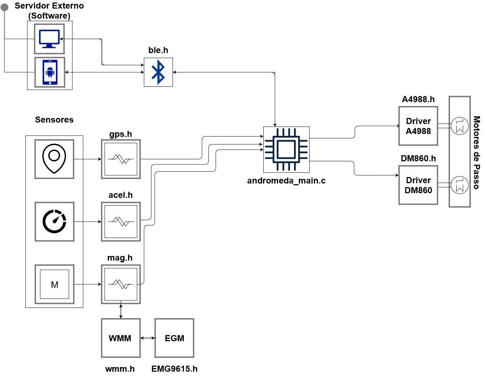
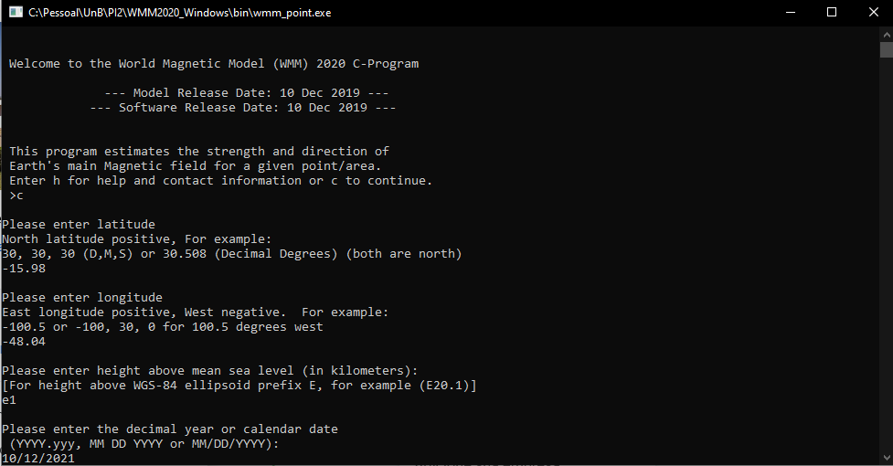
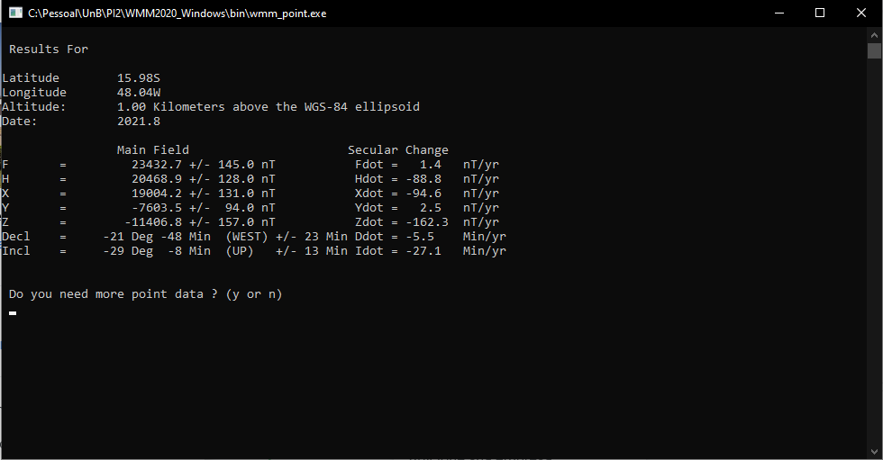
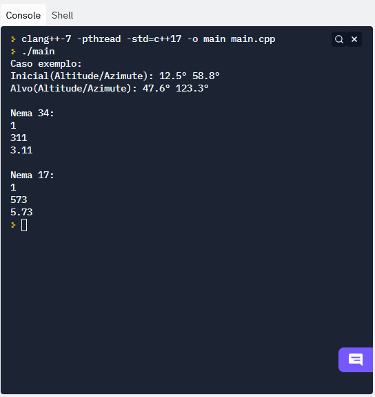
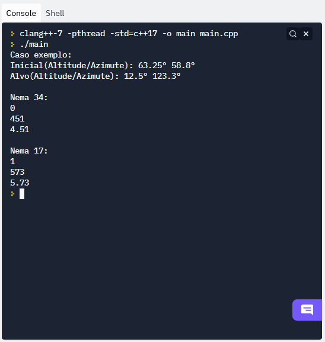

# Firmware Projeto Andrômeda

O projeto andrômeda é um modelo de suporte automatizado de telescópios. Este repositório apresenta as funções que são necessárias para implementação do 
firmware do projeto, realizado na UnB(FGA) no semestre 1/2021, para a disciplina Projeto Integrador II dos cursos de graduação em Engenharia.

## Visão Geral das relações entre Bibliotecas

As funções foram desenvolvidas usando a ide IDF da espressif systems. Com o editor do visual studio, partindo do modelo
hello world disponibilizado pela empresa. Além disso os módulos foram testados e seus testes de conceito estão apresentados abaixo.

## Vídeo do teste do sistema de Sensores

Foi feito um vídeo, com auxílio do computador, demonstrando os sensores reconhecendo os movimentos do corpo.

[Teste dos Sensores](https://github.com/esh2900/andromeda-firmware/blob/main/Media/teste_sensores.mp4?raw=true)

## Teste do Algoritmo do WMM(Wolrd Magnetic Model)

Para demonstrar o funcionamento, foi usado como exemplo as coordenadas do campus gama(FGA), no dia 12/10/2021, que é a semana de apresentação do trabalho

Além disso é possível testar esse subsistema com os arquivos presentes na pasta de destes do próprio repositório

## Teste dos Drivers e dos Motores de Passo

Para simular o comportamento dos drivers e dos motores de passo, foi feita uma simulação computacional utilizando o software Protheus. A apresentação do funcionamento do sistema pode ser acessada em:

[Teste dos Drivers](https://github.com/esh2900/andromeda-firmware/blob/main/Media/drivers.mp4?raw=true)

Além disso os arquivos da simulação também estão no repositório

[Arquivos Simulação](https://github.com/esh2900/andromeda-firmware/blob/main/Simulacao%20do%20Driver%20Proteus.rar?raw=true)

## Teste do Sistema de Controle

Por fim, foram desenvolvidas também algumas funções para determinar o tempo de envio dos sinais PWM aos drivers, e a direção de rotação mais curta.

A primeira variável presente no trio de informações de cada motor representa o sentido da rotação(horario/anti-horario), o segundo valor é a quantidade de passos que serão necessários para realizar a movimentação, e por fim, o tempo(em segundos) que será necessário manter os motores acionados para chegar na posição indicada.
